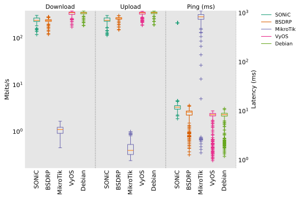
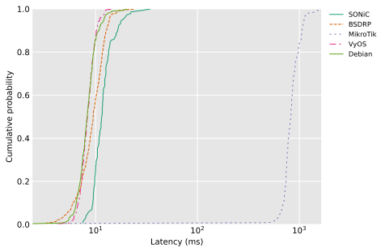
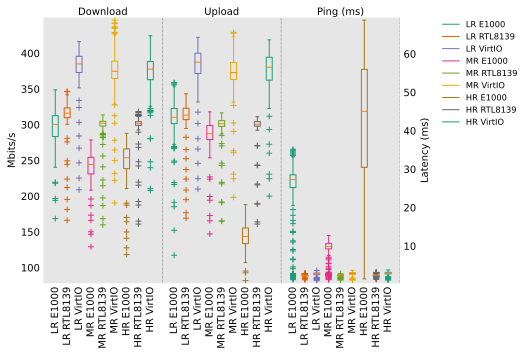
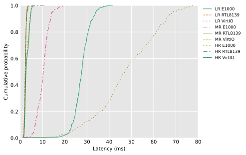

> [!WARNING]
> This is a PhD project, and it is still very WIP.

# Router OS benchmark

Benchmark and plot performances for router and network OSes.

## Prerequisites

- [GNS3 v2](https://www.gns3.com/)
- [QEMU](https://www.qemu.org/download/)
- [flent](https://flent.org/intro.html)
- `virt-builder` from libguestfs

### Optional but recommended

- [uv](https://github.com/astral-sh/uv)

## How to use

### 1. Install python packages

With uv:

```shell
uv sync
```

With pip:

```shell
pip install -r requirements.txt
```

### 2. Create custom Debian guest

> [!NOTE]
> This is guest is needed for running flent ([iperf3](https://github.com/esnet/iperf), [netperf](https://github.com/HewlettPackard/netperf), [fping](https://fping.org/), [irtt](https://github.com/heistp/irtt)) experiments through the network.

```shell
virt-builder debian-12 \
  --output debian-bookworm.qcow2 \
  --format qcow2 \
  --size 6G \
  --root-password password:debian \
  --upload sources.list:/etc/apt/sources.list \
  --install "netperf,iperf3,fping,irtt,htop,net-tools,flent"
```

### 3. Create an experiments

Example experiment file at `experiments/my_experiment.json`

> [!WARNING]
> When plotting many experiments at once, likely to compare tests with the same name,
> you have to set the "plot_legend_when_merged" attribute. It will be used as the legend for this experiment.
> > For example, if you want to compare an OS with E1000 and RTL8139 NICs, you can duplicate twice your experiment file, 
> > set "plot_legend_when_merged" to "xxxx E1000" in one and "xxxx RTL8139" in the other.

> [!WARNING]
> When specifying `null` for a router os attribute, all provided OSes will be tested on that router, thus generating many test results.

```json
{
  "experiment_name": "Simple topology VyOS",
  "plot_legend_when_merged": "VyOS E1000",
  "config": {
    "project_name": "router-os-benchmark",
    "template_prefix": "Benchmark",
    "guest_image_path": "/path/to/debian-bookworm.qcow2",
    "gns3": {
      "url": "http://127.0.0.1:3080",
      "server_username": "admin",
      "server_password": "gns3"
    }
  },
  "network": {
    "nodes": {
      "Client 1": {
        "type": "guest",
        "vcpu": 1,
        "ram": 1024,
        "ip": "10.0.1.2"
      },
      "Server 1": {
        "type": "guest",
        "vcpu": 1,
        "ram": 1024,
        "ip": "10.0.2.2"
      },
      "Router 1": {
        "type": "router",
        "vcpu": 2,
        "ram": 2048,
        "os": "VyOS",
        "nic": "e1000",
        "adapters": 6,
        "ips": [
          { "adapter": 3, "ip": "10.0.1.1" },
          { "adapter": 4, "ip": "10.0.2.1" }
        ]
      }
    },
    "links": [
      { "node_a": "Client 1", "adapter_a": 0, "node_b": "Router 1", "adapter_b": 3 },
      { "node_a": "Server 1", "adapter_a": 0, "node_b": "Router 1", "adapter_b": 4 }
    ]
  },
  "tests": [
    {
      "name": "test1",
      "test": "rrul",
      "fire_at": 0,
      "duration": 60,
      "from": "Client 1",
      "to": "Server 1"
    }
  ],
  "os_list": {
    "VyOS": {
      "input_ready": ":~",
      "trigger_sequence": null,
      "login": "vyos",
      "password": "vyos",
      "configuration": "iproute2",
      "interface_prefix": "eth",
      "interfaces_start_at": 0,
      "image_path": "/path/to/vyos-2025.04.04-0018-rolling-generic-amd64.iso"
    }
  }
}
```

### 4. Run the experiments

> [!TIP]
> You can use both of `-i` (for individual file input) and `-d` (for directory input) many times

One at a time:

```shell
./main.py run -i experiments/my_experiment_file.json
```

Many:

```shell
./main.py run -i experiments/my_experiment_file.json -i experiments/my_other_experiment_file.json
```

### 5. Plot the results

```shell
./main.py plot -i experiments/my_experiment_file.json

```

### 6. Clean the results

```shell
./main.py clean -i experiments/my_experiment_file.json
```

## Plot example

Realtime Response Under Load

### All OSes



### Debian



## Others

### Available experiments

from `flent --list-tests`

```
  bursts                     :  Latency measurements under intermittent UDP bursts
  bursts_11e                 :  802.11e Latency measurements under intermittent UDP bursts
  cisco_5tcpup               :  RTT Fair Realtime Response Under Load
  cisco_5tcpup_2udpflood     :  Cisco 5TCP up + 2 6Mbit UDP
  cubic_bbr                  :  Cubic VS BBR smackdown
  cubic_cdg                  :  Cubic VS CDG smackdown
  cubic_dctcp                :  Cubic VS DCTCP smackdown
  cubic_ledbat               :  Cubic VS Ledbat smackdown
  cubic_ledbat_1             :  Cubic vs LEDBAT upload streams w/ping
  cubic_reno                 :  Cubic VS Reno smackdown
  cubic_westwood             :  Cubic VS Westwood
  dashtest                   :  DASH testing
  dslreports_8dn             :  8 down - dslreports dsl test equivalent
  http                       :  HTTP latency test
  http-1down                 :  HTTP get latency with competing TCP download stream
  http-1up                   :  HTTP get latency with competing TCP upload stream
  http-rrul                  :  HTTP get latency with competing RRUL test
  iterated_bidirectional     :  Iterated TCP bidirectional transfers example
  ledbat_cubic_1             :  Cubic vs LEDBAT upload streams w/ping
  ping                       :  Ping test (ICMP and UDP)
  qdisc-stats                :  Capture qdisc stats
  reno_cubic_westwood_cdg    :  Realtime Response Under Load (with different congestion control algs)
  reno_cubic_westwood_ledbat :  Realtime Response Under Load (with different congestion control algs)
  reno_cubic_westwood_lp     :  Realtime Response Under Load (with different congestion control algs)
  rrul                       :  Realtime Response Under Load
  rrul46                     :  Realtime Response Under Load - Mixed IPv4/6
  rrul46compete              :  Realtime Response Under Load - Mixed v4/v6 compete
  rrul_100_up                :  100 up vs 1 down - exclusively Best Effort
  rrul_50_down               :  50 down vs 1 up - exclusively Best Effort
  rrul_50_up                 :  50 up vs 1 down - exclusively Best Effort
  rrul_be                    :  Realtime Response Under Load - exclusively Best Effort
  rrul_be_iperf              :  Realtime Response Under Load - exclusively Best Effort (Iperf TCP)
  rrul_be_nflows             :  Realtime Response Under Load - Best Effort, configurable no of flows
  rrul_cs8                   :  Realtime Response Under Load CS8, one flow per CS/precedence level
  rrul_icmp                  :  Realtime Response Under Load - Best Effort, only ICMP ping
  rrul_noclassification      :  Realtime Response Under Load - no classification on data flows
  rrul_prio                  :  Realtime Response Under Load - Test Prio Queue
  rrul_torrent               :  Torrent-like competition
  rrul_up                    :  Realtime Response Under Load - upload only
  rrul_var                   :  Realtime Response Under Load - variable configurable streams
  rtt_fair                   :  RTT Fair Realtime Response Under Load
  rtt_fair4be                :  RTT Fair Realtime Response Under Load
  rtt_fair6be                :  RTT Fair Realtime Response Under Load
  rtt_fair_up                :  RTT Fair upstream only
  rtt_fair_var               :  RTT Fair - variable number of hosts
  rtt_fair_var_down          :  RTT Fair - variable number of hosts (download only)
  rtt_fair_var_mixed         :  RTT Fair - variable number of hosts (mixed up and down)
  rtt_fair_var_up            :  RTT Fair - variable number of hosts (upload only)
  sctp_vs_tcp                :  SCTP vs TCP
  tcp_12down                 :  TCP download - 12 streams w/ping
  tcp_12up                   :  TCP upload - 12 streams w/ping
  tcp_1down                  :  Single TCP download stream w/ping
  tcp_1up                    :  Single TCP upload stream w/ping
  tcp_1up_noping             :  Single TCP upload stream
  tcp_2down                  :  TCP download - 2 streams w/ping
  tcp_2up                    :  TCP upload - 2 streams w/ping
  tcp_2up_delay              :  Two TCP upload streams; 2nd stream started delayed
  tcp_2up_square             :  Two TCP upload streams; 2nd stream started delayed
  tcp_2up_square_westwood    :  Two TCP upload streams; 2nd stream started delayed
  tcp_4down                  :  TCP download - 4 streams w/ping
  tcp_4up                    :  TCP upload - 4 streams w/ping
  tcp_4up_squarewave         :  Four TCP upload streams; 2nd streams started delayed, cubic vs BBR
  tcp_50up                   :  TCP upload - 8 streams w/ping
  tcp_6down                  :  TCP download - 6 streams w/ping
  tcp_6up                    :  TCP upload - 6 streams w/ping
  tcp_8down                  :  TCP download - 8 streams w/ping
  tcp_8up                    :  TCP upload - 8 streams w/ping
  tcp_bidirectional          :  Bidirectional TCP streams w/ping
  tcp_download               :  TCP download stream w/ping
  tcp_ndown                  :  TCP download - N streams w/ping
  tcp_nup                    :  TCP upload - N streams w/ping
  tcp_upload                 :  TCP upload stream w/ping
  tcp_upload_1000            :  1000 up - exclusively Best Effort
  tcp_upload_prio            :  TCP upload stream w/ToS prio bits
  udp_flood                  :  UDP flood w/ping
  udp_flood_var_up           :  UDP flood w/ping - variable number of hosts
  udp_flood_var_up_stagger   :  UDP flood w/ping - variable number of hosts, staggered start
  voip                       :  VoIP one-way stream test
  voip-1up                   :  VoIP one-way stream test with competing TCP stream
  voip-rrul                  :  VoIP one-way stream test with competing RRUL test
```

### Available NICs

from https://en.wikibooks.org/wiki/QEMU/Devices/Network

```
e1000, e1000e	  : 10/100/1000Mb/s Intel 82540em / PRO/1000
i82550
i82551            : 10/100Mb/s      Intel 10/100 Mbps Fast Ethernet
i82557a,b,c       : 10/100Mb/s      Intel 10/100 Mbps Fast Ethernet
i82558a           : 10/100Mb/s      Intel 10/100 Mbps Fast Ethernet
i82559a,b,c,er    : 10/100Mb/s      Intel 10/100 Mbps Fast Ethernet
i82562
i82801
igb
ne2k_pci          : 10Mb/s          RTL8029 - NE2000 PCI
pcnet             : 10/100Mb/s      AMD PCnet FAST III Ethernet
rocker
rtl8139           : 10/100Mb/s      Realtek Fast Ethernet
virtio-net-pci    : 1Gb/s           Virtual High Performance Ethernet card
```