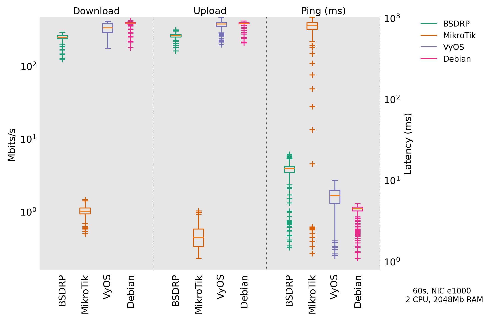

> [!WARNING]
> This is a PhD project, and it is still very WIP.

# Router OS benchmark

Benchmark and plot performances for router and network OSes.

## Prerequisites

- `uv`
- `GNS3`
- `QEMU`
- `virt-builder` from libguestfs
- `flent`

## Create custom Debian guest

```shell
virt-builder debian-12 \
  --output debian-bookworm.qcow2 \
  --format qcow2 \
  --size 6G \
  --root-password password:debian \
  --upload sources.list:/etc/apt/sources.list \
  --install "netperf,iperf3,fping,irtt,htop,net-tools,flent"
```

## Fulfil the experiments file

Example `experiments.json` file

```json
{
  "config": {
    "gns3_url": "http://127.0.0.1:3080",
    "gns3_server_username": "admin",
    "gns3_server_password": "gns3",
    "project_name": "router-os-benchmark",
    "guest_image_path": "/path/to/debian-bookworm.qcow2"
  },
  "experiment": {
    "name": "rrul",
    "duration": 60,
    "runs": 1,
    "router_vcpu": 2,
    "router_ram": 2048,
    "router_nic": "e1000",
    "guest_vcpu": 1,
    "guest_ram": 1024,
    "client_side_network": "10.0.1.0",
    "server_side_network": "10.0.2.0"
  },
  "os_list": {
    "MikroTik": {
      "input_ready": " >",
      "login": "admin",
      "password": "test",
      "trigger_sequence": null,
      "configuration": [
        "ip address add address={ROUTER_CLIENT_SIDE_IP} interface={INTERFACE_PREFIX}1",
        "ip address add address={ROUTER_SERVER_SIDE_IP} interface={INTERFACE_PREFIX}2",
        "ip route add dst-address={CLIENT_SIDE_NETWORK}/24 gateway={INTERFACE_PREFIX}1",
        "ip route add dst-address={SERVER_SIDE_NETWORK}/24 gateway={INTERFACE_PREFIX}2"
      ],
      "interface_prefix": "ether",
      "image_path": "/path/to/chr-6.49.18.img"
    },
    "VyOS": {
      "login": "vyos",
      "password": "vyos",
      "trigger_sequence": null,
      "configuration": "iproute2",
      "interface_prefix": "ens",
      "image_path": "/path/to/vyos-2025.04.04-0018-rolling-generic-amd64.iso"
    }
  }
}
```

## Run the experiments

```shell
uv run main.py
```

## Plot the results

```shell
uv run plot.py
```

## Result example

